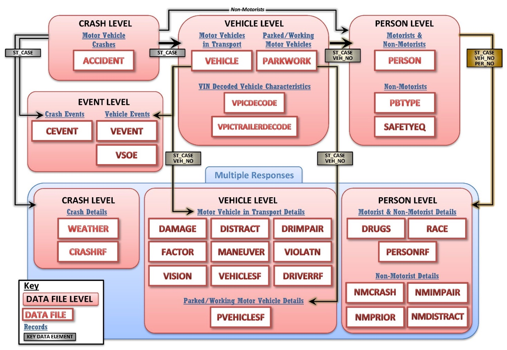
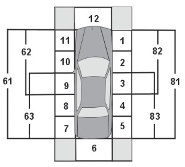

L. Sandoval CIND 820 D1H Fall 2022

# CIND820 Data Analytics Project Fall 2022

The purpose of this study is to use of publicly available data provided by National Highway Traffic Safety Administration (NHTSA) of motor-vehicle accidents and contributing factors as well as available vehicle safety-feature databases in order to analyze potential impact of safety features in reducing accident incidence.

# Data Sources

## NHSTA Fatality Analisys Report System (FARS)

The FARS dataset is a census of fatal motor vehicle crashes, i.e., it contains the actual records of fatal accidents in the United States. The dataset is segregated into multiple tables that capture accident information in a very detailed set of data elements or fields. The full detail of the data dictionary as well as data gathering methodology for FARS is described in [1]. For Year 2020 the FARS dataset includes 35,766 entries for accidents and 54,271 for vehicles, and a total of 33 tables covering different aspects of accident information.

Datset location:
https://www.nhtsa.gov/file-downloads?p=nhtsa/downloads/FARS/

See reference 12 below.

**FARS ER diagram**

## New York State Vehicle, Snowmobile, and Boat Registrations

The New York State DMV (Department of Motor Vehicle) Vehicle, Snowmobile and Boat Registration will be leveraged in order to determine the motor vehicle census for the State in order to identify the vehicle pool present in the State, their features and compare against the FARS data set to evaluate vehicle features related to crash incidence. THE NYSDMV registration dataset includes records for 11,350,911 registered motor vehicles.

https://data.ny.gov/Transportation/Vehicle-Snowmobile-and-Boat-Registrations/w4pv-hbkt

## NHSTA VIN decoder API

The vPIC VIN decoder API is going to be used to augment the NYSDMV Vehicle Registration dataset with detailed vehicle features, specifically Safety-related features. VIN decoding information is based on vehicle manufacturer information submissions to NHSTA and it is supports vehicle model years starting in 1981

https://vpic.nhtsa.dot.gov/api/

# Technical Reports and Methodology

The steps that have been followed (in cronological order) and the associated files are listed below:

## Data Preparation 

1. Notebook: [data/getnhtsa-data.sh](data/getnhtsa-data.sh)

This faile takes care of downloading and uncompressing FARS and CRSS data, as well as downloading (via query) NY DMS vehicle registration data. The data is saved in [data/](data/) directory in the local copy of the git repository, however it is not uploaded to github due to file size considerations.

2. Notebook: [00-fars-dataload.ipynb](00-fars-dataload.ipynb) 

This notebook handles reading FARS data, doing some basic verifications and cleaning and presenting a few descriptive statistics of it. It also saves some of the processed output to be used as input in the analysis stage.

3. Notebook: [01-crss-dataload.ipynb](01-crss-dataload.ipynb)

Handles reading CRSS data doing some basic verifications and cleaning and presenting a few descriptive statistics of it. However this data is not used laster in the analysis for teh reasons presented above when describing FARS.

4. Notebook: [02-nysdmv-dataload.ipynb](02-nysdmv-dataload.ipynb)

This notebook handles reading registration records from New York State Department of Motor Vehicles (NYSDMV), doing some basic verifications and cleaning and presenting a few descriptive statistics of it. It also saves some of the processed output to be used as input in the additional stages for NYDMV.

5. NYDMV VIN decoding scripts:

    5.1 Python script [vin-decode.py](vin-decode.py) and unix shell script [getnyvindecode.sh](getnyvindecode.sh): vin-decode.py takes care of execuiting the API calls to specificied range of entries in NYDMV csv file, and the wrapper getnyvindecode.sh executes them in parallel as this is a very slow process that will take days to run.

    5.2 [vin-merge-nydmv.sh](vin-merge-nydmv.sh) takes files produced above and generates a merged file with all the downloaded entires 

    5.3 [nysreg-vin-fixdoublequotes.py](nysreg-vin-fixdoublequotes.py) takes care of fixing encoding errors from vin-decode.py in the merged file

    5.4 [nysreg-vin-decode-to-usable-csv.py](nysreg-vin-decode-to-usable-csv.py) take output from step above and generates usable csv file that can be used for analysis, it also takes care of removing unncesseary columns

6. Notebook: [04-nydmv-vinchecks.ipynb](04-nydmv-vinchecks.ipynb)

Additional NYDMV VIN checks and file curation

## Data Analysis

7. Notebook: [05-analysismodeling.ipynb](05-analysismodeling.ipynb): this file contains the alaysis with the two datasets FARS and NYS DMV records, it is structured as follows:

    1. Data Load and FARS and NYS DMV data alignment: make the two datasets compatible, add additional groupings and general data sanitation

    2. Implementing Induced Exposure tagging of vehicles in FARS as either at Fault or not at Fault depending on where the vehicle is impacted (see image). Vehicles involved in either single vehicle crases or that have front imacts (marked 11,12,1) are deemend at Fault (or __'Fault'__ in the charts). See references below.
  
    3. Implementation of machile learning algorithms to try to identify feature importance in contrinuting to an "at Fault" accident. Dependent variable: __Fault__ (as per Induced Exposure definition above). 
    The features to be fed into the ML algorithms are:

    Feature | description
    -- | --
    RUR_URB | Identifies if road is in a designated rural or urban area.
    FUNC_SYS | Identifies type of road based on functional classification (Interstate, Principal FARS Arterial – Other Freeways and Expressways,Principal Arterial – Other, Minor Arterial, Major Collector, Minor Collector, Local, Trafficway Not in State Inventory, Not Reported, Unknown)
    VNUM_LAN | Number of road lanes 
    LGT_COND | Indicates type/level of light that existed at the time of the crash.
    WEATHER | Indicates the prevailing atmospheric condition at the time of the crash.
    VSURCOND | Road surface condition (wet, frozen, covered in snow, etc)
    VSPD_LIM_GRP | Road speed limit (partitioned in groups)
    ModelId | Vehicle make and model
    ModelYear | Vehicle manufacture year
    VehicleGroup | Vehicle type derived from Body Type in VIN table
    Pedestrian | Inidcated if pedestrians were involved
    SEX | Sex of the driver
    AGE_GRP | Age group of the driver
    DR_DRINK | Indicates if driver had a high alcohol level.
    Safety Features | Presence of safety features as standard in the vehicke ('AntilockBrakeSystem', 'AdaptiveCruiseControl', 'AdaptiveDrivingBeam', 'AutoPedestrianAlertingSound', 'BlindSpotWarning', 'CrashImminentBraking', 'DaytimeRunningLight', 'DynamicBrakeSupport', 'ElectronicStabilityControl',  'ForwardCollisionWarning', 'LaneDepartureWarning', 'LaneKeepingAssistance', 'PedestrianAutoEmergencyBraking', 'SemiAutoHeadlampBeamSwitching', 'TPMS', 'TractionControl')

    4. Determine Feature Correlation

    5. ML algorithms tested: Decision Tree, Logistic Regression, Random Forest. SKlaern NBClassifier was attemped but conitnues to fail due to [this issue](https://github.com/scikit-learn/scikit-learn/issues/16028). Still looking into workarounds. Feature imporance will be gathered form output of these algorithms.

    6. Use NYS Registration compared against FARS data to Identify Fatal Accident Rates for Most Popular Vehicles Models and Vehicle Manufacture Years. Pending: adding fatal accidents rates for vehicles with different safety features.

    7. Accident Risk Reduction due to Safety Featyres based on Induced exposure metrics. This would be most important section in the reports, presenting:

        a. Overall Safey Feature effectiveness

        b. Safety Feature effectiveness under different road, evnronment features and/or conditions

        c. Safety Feature effectiveness fir different driver characteristics

        d. Safety effectivieness for Top 20 vehicles appearing in the FARS data

        e. Comparatively effectiveness of safety features for the Top 20 vehicles

# References used in the analysis above

## At Fault definition

Following Induced Exposure Model Approach from [1]: *"...the set of comparison crashes was defined to be all multivehicle crashes where the focus vehicle was impacted from the rear or to either side. Risk was assessed to be the odds of all other crash types (frontal impact multivehicle crashes or single-vehicle crashes) compared to the comparison crashes."* and similarly in [2] "the vehicles/drivers involved in ... crashes can be split into striking group and struck group respectively. This analysis method is based on Quasi-induced exposure concept. Here, the striking vehicles/drivers can be considered as the at-fault ones and the struck vehicles/drivers are not-at-fault ones."

The IMPACT1 variable indicates where impact ocurred. Front impact = 1,11,12

1. Michael D. Keall & Stuart Newstead (2016) Development of a method to rate the primary safety of vehicles using linked New Zealand crash and vehicle licensing data, Traffic Injury Prevention, 17:2, 151-158, DOI: 10.1080/15389588.2015.1045064. https://doi-org.ezproxy.lib.ryerson.ca/10.1080/15389588.2015.1045064

2. Xuedong Yan & Essam Radwan (2006) Analyses of Rear-End Crashes Based on Classification Tree Models, Traffic Injury Prevention, 7:3, 276-282, DOI: 10.1080/15389580600660062. https://doi.org/10.1080/15389580600660062

## Effectiveness (i.e., risk reduction)

The effectiveness of a safety feature is mesured using the following approach:

Measure|Formula
-- | --
Risk |               $R = \frac{S_f}{S_n}/\frac{N_f}{N_n}$
Effectiveness (%) |  $E = (1 - R)$
Std Error in log odds ration | $\sigma_{ln(R)} = \sqrt{\frac{1}{S_f} + \frac{1}{S_n} + \frac{1}{N_f} + \frac{1}{N_n}}$
Effectiveness lower limit (95% confidence) |  $E_{lower} = 1 - e^{(ln(R) + \sigma_{ln(R)})}$
Effectiveness upper limit (95% confidence) | $E_{upper} = 1 - e^{(ln(R) - \sigma_{ln(R)})}$

* $S_f =$ Fault accidents with Safety Feature present
* $S_n =$ Not-fault accidents with Safety Feature present
* $N_f =$ Fault accidents without Feature present
* $N_n =$ Not-fault accidents without Safety Feature present

Based on 

3. Leonard Evans (1999) Antilock Brake Systems and Risk of Different Types of Crashes in Traffic, Traffic Injury Prevention, 1:1, 5-23, DOI: 10.1080/10286589908915737. https://doi.org/10.1080/10286589908915737

4. Simon Sternlund, Johan Strandroth, Matteo Rizzi, Anders Lie & Claes Tingvall (2017) The effectiveness of lane departure warning systems—A reduction in real-world passenger car injury crashes, Traffic Injury Prevention, 18:2, 225-229, DOI: 10.1080/15389588.2016.1230672. https://doi-org.ezproxy.lib.ryerson.ca/10.1080/15389588.2016.1230672

## Additional references

5. Xu JQ, Murphy SL, Kochanek KD, and Arias E. Deaths: Final data for 2019. National Vital Statistics Reports; vol 70 no 08. Hyattsville, MD: National Center for Health Statistics. 2021. DOI: https://dx.doi.org/10.15620/cdc:106058.
6. M.R. Spencer, H. Hedegaard, M. Garnet. (2021, March). Motor vehicle traffic death rates by sex, age group, and road-user type : United States, 1999-2019. National Center for Health Statistics (U.S.). NCHS data brief ; no. 400. https://stacks.cdc.gov/view/cdc/101759.
7. Stewart, T. (2022, March). Overview of motor vehicle crashes in 2020 (Report No. DOT HS 813 266). National Highway Traffic Safety Administration. https://crashstats.nhtsa.dot.gov/ Api/Public/ViewPublication/813266
8. National Center for Statistics and Analysis. (2022, May). Distracted driving 2020 (Research Note. Report No. DOT HS 813 309). National Highway Traffic Safety Administration. https://crashstats.nhtsa.dot.gov/Api/Public/ViewPublication/813309
9. Insurance Institute for Highway Safety-Highway Loss Data Institute. Driver death rates by make and model. IIHS-HLDI Status Report, Vol. 55, No. 2 May 28, 2020. Pp. 1-5. https:// www.iihs.org/api/datastoredocument/status-report/pdf/55/2
10. Elisa R. Braver, Sergey Y. Kyrychenko & Susan A. Ferguson (2005) Driver Mortality in Frontal Crashes: Comparison of Newer and Older Airbag Designs, Traffic Injury Prevention, 6:1, 24-30, DOI: 10.1080/15389580590903140. https://doi-org.ezproxy.lib.ryerson.ca/ 10.1080/15389580590903140
11. Gabriel E. Ryb, Patricia C. Dischinger & Shiu Ho (2009) Vehicle Model Year and Crash Outcomes: A CIREN Study, Traffic Injury Prevention, 10:6, 560-566, DOI: 10.1080/15389580903271401. https://doi-org.ezproxy.lib.ryerson.ca/10.1080/15389580903271401
12. National Center for Statistics and Analysis. (2022, August (Revised)). Fatality Analysis Reporting System analytical user’s manual, 1975-2020 (Report No. DOT HS 813 254). National Highway Traffic Safety Administration. https://crashstats.nhtsa.dot.gov/Api/ Public/ViewPublication/813254. FARS data access: https://www.nhtsa.gov/file-downloads? p=nhtsa/downloads/FARS/. National Center for Statistics and Analysis. (2022, July (Revised)).
13. Crash Report Sampling System analytical user’s manual, 2016-2020 (Report No. DOT HS 813 236). National Highway Traffic Safety Administration. https://crashstats.nhtsa.dot.gov/ Api/Public/Publication/813236. CRSS data access: https://www.nhtsa.gov/file-downloads? p=nhtsa/downloads/CRSS/.
14. National Center for Statistics and Analysis. (2022, January). Product information catalog and vehicle listing (vPIC) analytical user's manual, 2020 (Report No. DOT HS 813 252). National Highway Traffic Safety Administration. https://crashstats.nhtsa.dot.gov/Api/Public/ Publication/813252. VIN tools access: https://vpic.nhtsa.dot.gov/about.html.

